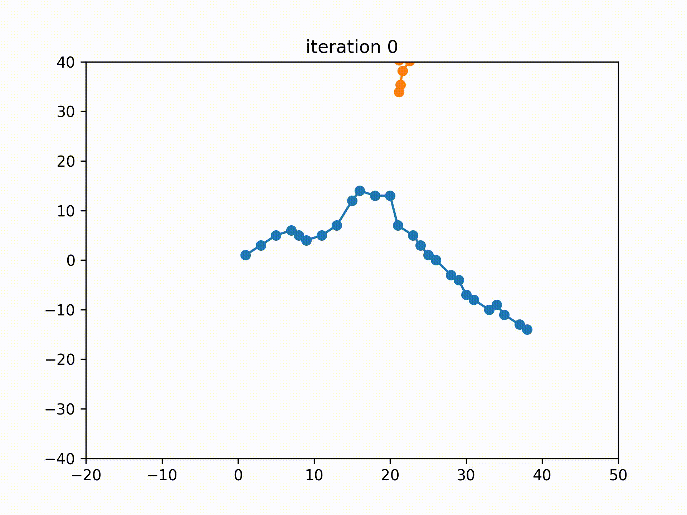
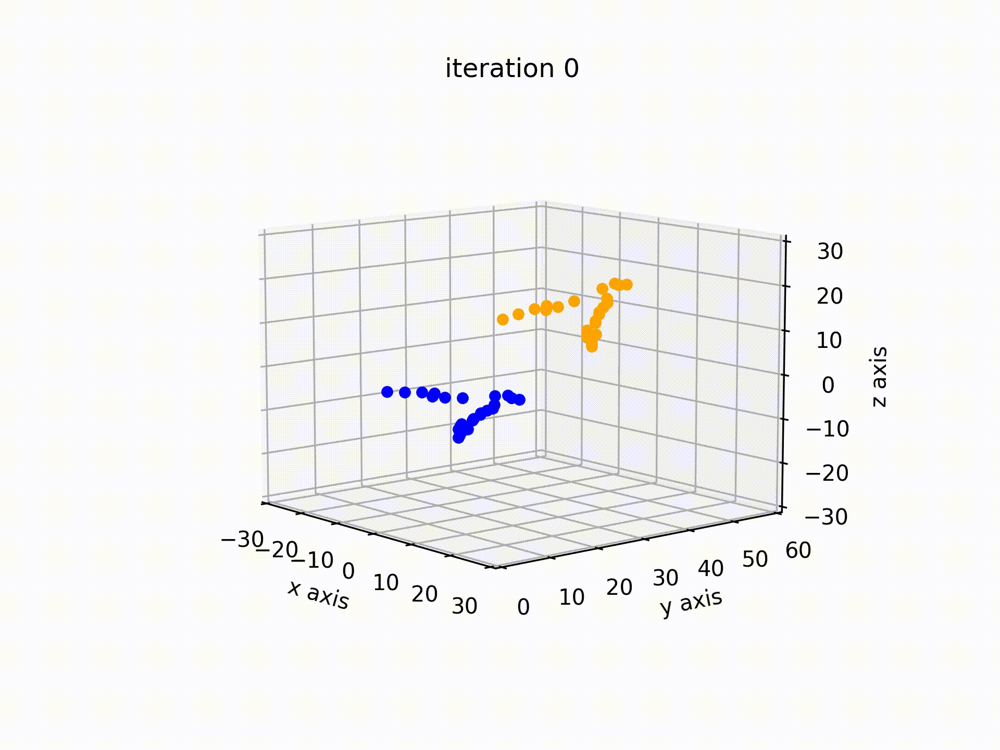

# 3D Shape Registration
> Umberto Castellani and Adrien Bartoli

This repository contains python3 code implementation of the [3D shape registration article](http://encov.ip.uca.fr/publications/pubfiles/2020_Castellani_etal_3DIAA_registration.pdf) by Dr. Castellani and Dr. Bartoli

## 2D registration demo
Although the main focus of this literature is 3D registration, the concept can be extrapolated for 2D registration as well. As a matter of fact,
2D registration is used to check the correctness of this implementation. 2D registration can be visualized by running the file *two_dimension_registration_demo.py*.

```bash
cd demo && python3 two_dimension_registration_demo.py
```
### 2D registration demo output


## 3D registration demo
Given two dataset, where one is the rigidly translated and rotated form of another, ICP can be used to find the translation and rotation
matrices to fit one dataset on another. A demo can be run using

```bash
cd demo && python3 three_dimension_registration_demo.py
```

### 3D registration demo output
