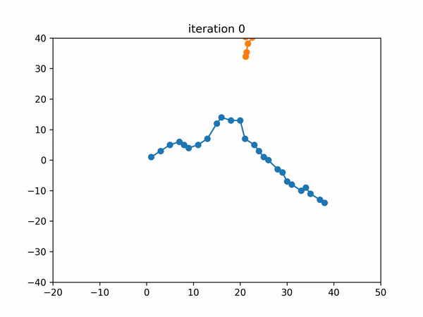

# 3D Shape Registration
> Umberto Castellani and Adrien Bartoli

This repository contains python3 code implementation of the [3D shape registration article](http://encov.ip.uca.fr/publications/pubfiles/2020_Castellani_etal_3DIAA_registration.pdf) by Dr. Castellani and Dr. Bartoli

## 2D registration demo
Although the main focus of this literature is 3D registration, the concept can be extrapolated for 2D registration as well. As a matter of fact,
2D registration is used to check the correctness of this implementation. 2D registration can be visualized by running the file *two_dimensional_registration_test.py*.

```
python3 two_dimension_registration_test.py
```
### 2D registration demo output
